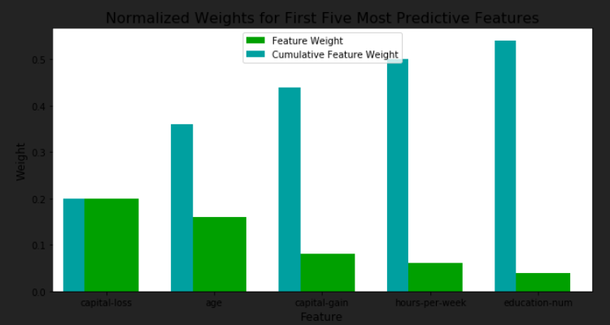

# Finding_donors
Major purpose of this project is to develop a machine learning algorithm for a ficticious charity organization.We will develop a model that will allow company to predict wether a certain user have income greater then 50K USD or less.If a person have income greater then 50K Usd this means that person possibly can have enough money to donate to our organization.
# Getting started
First we will download required dependencies to get started with this project
```
pip install numpy
pip install sklearn
pip install matplotlib
```
# Outcome
Major purpose of this project is to develop a machine learning algorithm for a ficticious charity organization.We will develop a model that will allow company to predict wether a certain user have income greater then 50K USD or less.If a person have income greater then 50K Usd this means that person possibly can have enough money to donate to our organization.    
Choose a scikit-learn classifier (e.g., adaboost, random forests) that has a feature_importance_ attribute, which is a function that ranks the importance of features according to the chosen classifier. In the next python cell fit this classifier to training set and use this attribute to determine the top 5 most important features for the census dataset.    

# Usage Example
Our main code in written in a well documented notebook that explains everything perform data acquistion to data preprocessing and eventually data modelling with various contraints.
However here are some usage examples,
```
bestclf.predict(X_train)
```
where X_train is a set of features on which our data will make predictions in following order.   
   

# License
This project is licensed under [MIT License]('https://choosealicense.com/licenses/mit/')
Now your setup is ready for running this project.
